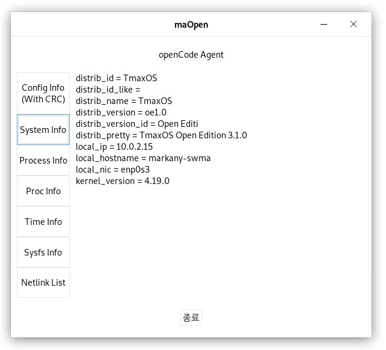

# openCode

# 소개
본 프로젝트는 리눅스 환경에서 응용 프로그램을 작성하기 위해 필요한 다양한 기능들을 라이브러리화 하고, 해당 기능을 이용하여 빠른 기능 개발을 지원하기 위한 기반을 제공하기 위한 프로젝트입니다. 일반적으로 리눅스에서 처음 개발하는 개발자들의 접근성을 높이기 위해 커널 모듈과 사용자 영역에서의 정보 교환 예제를 기반으로 라이브러리를 활용하는 프로그램을 제공합니다.
<br><br>
본 프로그램은 ```개방형 OS```에서 동작하도록 구성되어 있으므로 반드시 개방형 OS에서만 테스트를 수행하시기 바랍니다.
<br><br>
프로그램 구성은 다음과 같습니다.
* 커널 3.6 이상, 4.19 이하에서 빌드 가능한 커널 모듈
* GNOME 데스크탑 UI 지원 에이전트 에이전트
* ```GTK+ 3.0``` 기반 ```GTKMM(C++)```과 ```C```언어로 구성된 2개의 에이전트
<br><br>
프로그램의 실행 테스트가 완료된 개방형 OS
* Tmax OS OE(Open Edition) [Link](https://tmaxanc.com/)
* Gooroom OS [Link](https://www.gooroom.kr/)
* HomoniKR OS [Link](https://hamonikr.org/)
<br><br>

관련한 추가 정보는 (주)마크애니 [지식블로그](https://www.markany.com/kr/blog/)에서 확인하실 수 있습니다.
<br><br>

# 빌드 및 결과물
저장소 최상위의 Makefile을 이용하면, 포함된 전체 구성물을 빌드합니다.
<br>
별도 빌드가 필요한 위치에는 반드시 Makefile이 포함되어 있어 별도 빌드도 가능합니다.
<br>
모든 빌드는 저장소 최상위 bin/ 디렉터리에 결과물을 보관하도록 구성되어 있습니다.
<br>
빌드에 따라 bin/ 디렉터리 아래에 아래의 파일들이 생성됩니다.
* ```maOpen.ko``` : 커널 모듈
* ```libopencode.so``` : 유틸리티 라이브러리
* ```maOpen``` : C++ GUI 에이전트
* ```maCopen``` : C GUI 에이전트
* ```config.cfg``` : 환경 설정 정보 파일
<br><br>

# 에이전트 실행 및 정보
빌드된 GUI 에이전트 실행 화면은 maOpen, maCopen 모두 다음과 같은 형태로 실행됩니다.
<br>



그림과 같이 구성된 에이전트는 본 프로젝트에서 제공하는 라이브러리 대부분의 기능을 사용하여 구성되어 있고, 간단한 버튼 클릭만으로 정보를 획득할 수 있도록 구성되어 있습니다.

좌측 각 버튼의 기능은 다음과 같습니다.
* `Config Info`(`With CRC`) : config.cfg에서 읽어들인 정보와 CRC 값을 오른쪽 라벨에 출력
* `System Info` : 그림과 같이 현재 시스템 정보를 획득하여 출력
* `Process Info` : 에이전트의 동작 정보 출력
* `Proc Info` : 커널 심볼과 모듈의 적재 상태 확인 정보
* `Time Info` : 시간 정보
* `Sysfs Info` : maOpen.ko 모듈이 적재되면 획득할 수 있는 정보
* `Netlink Info` : maOpen.ko 모듈 적재 후, sysfs 파일에 접근한 로그 기록을 획득하여 출력

위와 같은 기능들을 구성하기 위해 제공되는 라이브러리와 에이전트 전체 소스 코드를 공개하였기 때문에 많은 개발자에게 도움이 될 것입니다.
<br><br>

# 커널 모듈 적재 및 확인 방법
커널 모듈은 커널에 직접 빌드된 결과물이 적재되기 때문에 일반 사용자 권한이 아닌 관리자 권한으로 적재해야 합니다.

* `sudo insmod maOpen.ko` : 빌드된 커널 모듈을 적재
* `lsmod | grep maOpen` : 모듈 적재 여부 확인
* `sudo rmmod maOpen` : 적재된 모듈을 해제

커널 모듈에서는 적재 및 해제 시에 간단한 메시지를 출력하는데, 이를 확인하는 방법은 다음과 같습니다.
* `sudo dmesg` : 커널 로그를 출력
<br><br>

# 획득 가능 정보
본 프로젝트를 통해 획득할 수 있는 정보들은 다음과 같다.
<br>

* 개방형 OS에서 프로그램 개발을 위해 필요한 기반 정보
* 사용자 정의 라이브러리 빌드 및 적용 방법
* 다양한 기능이 구현된 라이브러리로 시스템 프로그래밍 기반 정보
* 커널 파일 시스템을 이용한 커널 모듈 정보 획득 방법
* 커널에서 발생한 정보를 응용 프로그램이 소켓 통신으로 획득하는 방법
* 커널 모듈의 빌드 방법과 동작 구조
* GTKMM을 이용한 C++ GUI 프로그램 구조와 동작 방법
* C로 구현한 GUI 프로그램 구조와 동작 방법
* 라이브러리를 이용하여 작성된 ```GTK+ 3.0``` 기반 사용자 응용 프로그램

관련된 세부사항은 소스 코드의 주석을 확인하시기 바랍니다.
<br>
```모든 소스```는 `Doxygen` 스타일로 주석이 입력되어있으며, 모든 자료형과 상세 기능 등에 대해서도 주석이 입력되어 있습니다. 소스 코드의 접근이 어려우신 경우, Doxygen 프로그램을 이용하여 문서를 생성한 다음 확인하실 수도 있습니다.
<br><br>

# 목표
본 프로젝트의 주요 결과물인 라이브러리가 많은 개발자들에게 제공되어 도움이 되고, 다수의 기여자들에의해 최종적으로 개방형 OS에 탑재되여 다양한 응용 프로그램에 의해 사용되고 활용되는 것을 목표로 한다.


## 라이선스

[GPL-3.0](LICENSE)
